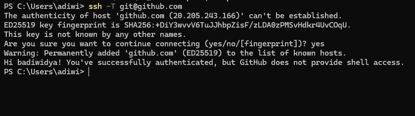
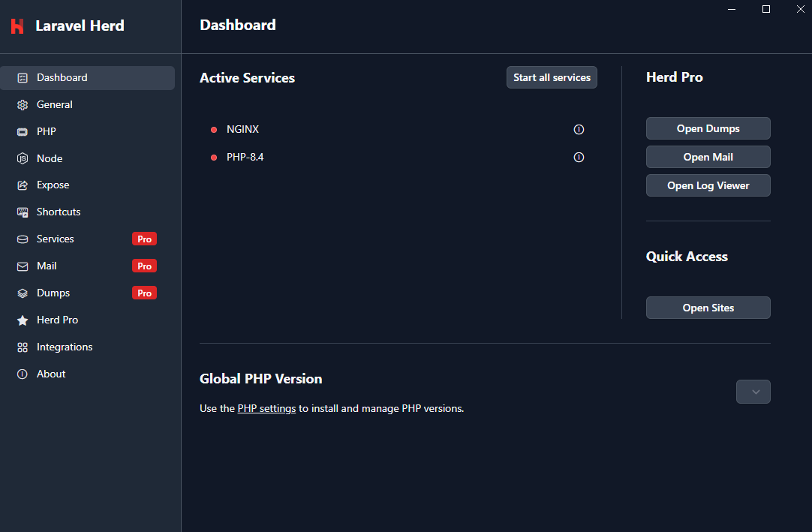
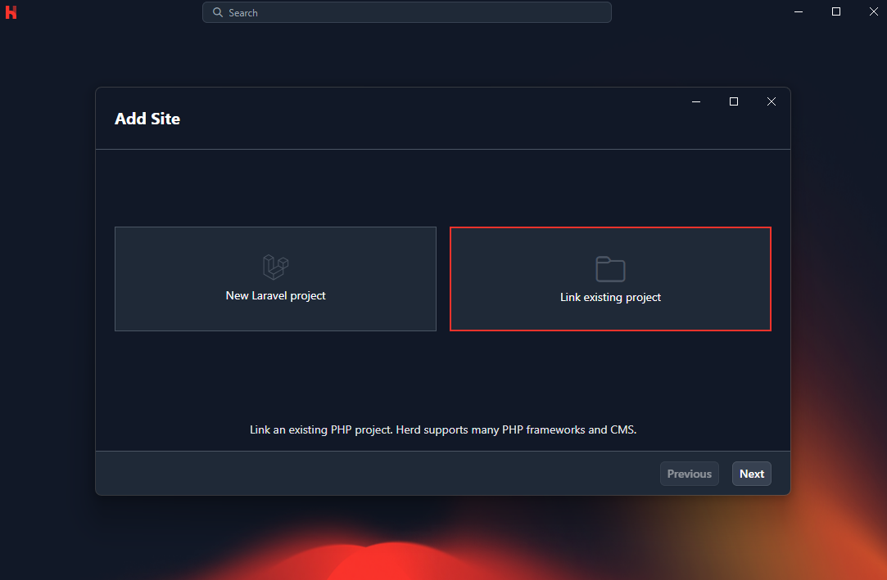
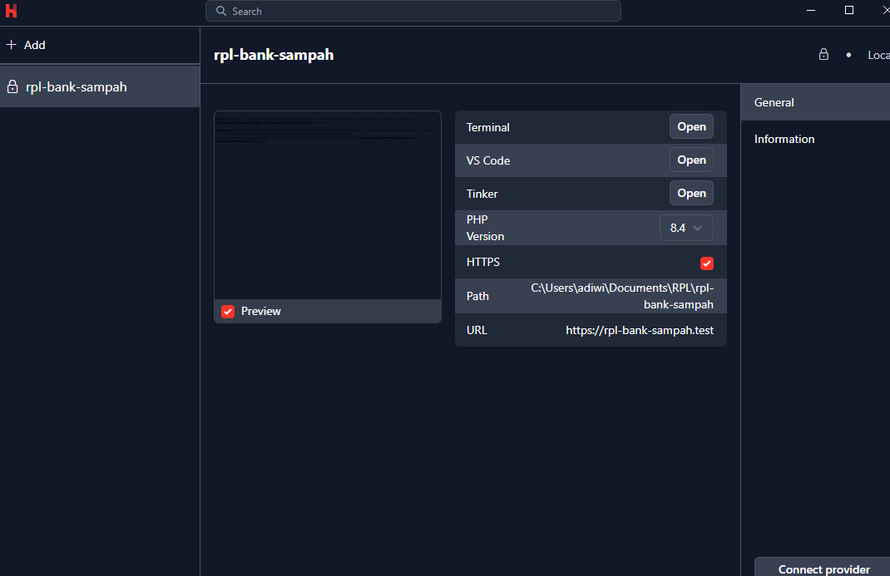
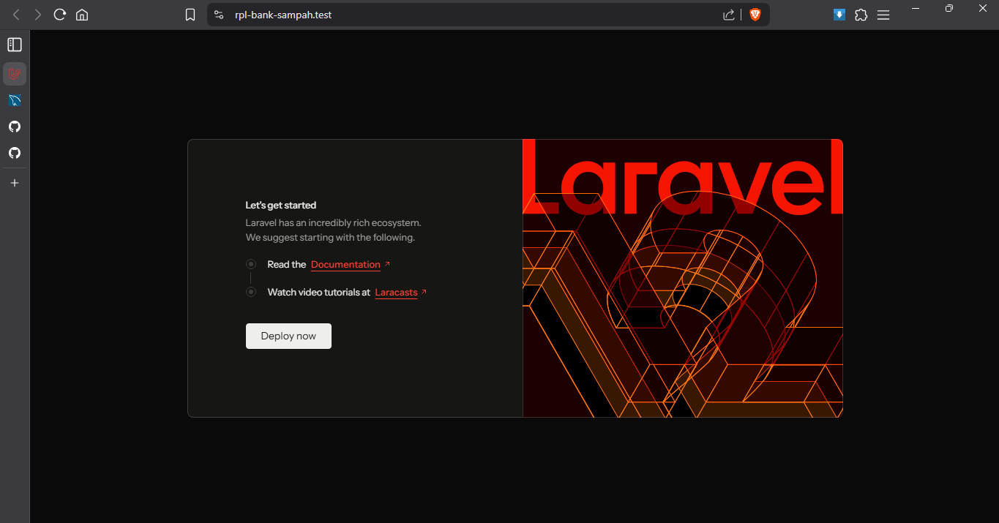

# Proyek RPL - Bank Sampah IPB

## Daftar Isi
- [Anggota Kelompok](#anggota-kelompok)
- [Tools Yang Harus Dipasang](#tools-yang-harus-dipasang)
- [Konek Github Pake SSH](#konek-github-pake-ssh)
  - [Periksa udah ada ssh key di device apa belum](#periksa-udah-ada-ssh-key-di-device-apa-belum)
  - [Bikin SSH key](#bikin-ssh-key)
  - [Masukin key public ke setting Github](#masukin-key-public-ke-setting-github)
- [Clone Repository](#clone-repository)
- [Jalanin Proyek Laravel](#jalanin-proyek-laravel)
  - [MySQL](#mysql)
  - [Laravel Herd](#laravel-herd)
- [Alur Kerja Git dan Github](#alur-kerja-git-dan-github)

## Anggota Kelompok:
- Najma Hamidha (G6401231004)
- Nisa Amelia (G6401231022)
- Berton Adiwidya Wibowo (G6401231043)
- Ibnu Burhanudin Habibi (G6401231100)
- Muhammad Fauzan Zubaedi (G6401231129)

## Tools Yang Harus Dipasang
- PHP versi 8.2 ke atas
- Composer
- MySQL (?) (tentative untuk pilihan database)
- Nodejs

> 💡 **Note:** bisa install Laravel Herd/Laragon kalo ga mau ribet install satu satu.

Untuk yang pake windows bisa pake [Laragon](https://laragon.org/) yang all-in-one, sekaligus sama mysql-nya (pake lisensi berbayar, free juga bisa setau gua tapi pop up lisensi pakal muncul terus, ganggu) dan kalo macos bisa pake [Laravel Herd](https://herd.laravel.com/).

Windows juga bisa pake Laravel Herd, tapi kalo pake Herd harus setup MySQL sendiri. Kalo proyek Basis Data dulu pake MySQL dan belum pernah otak atik lagi sampe sekarang, harusnya udah jalan MySQL-nya.

## Konek Github Pake SSH
### Periksa udah ada SSH key di device apa belum
1. Buka terminal/windows powershell, ketik:
```
ls .ssh
```
2. Kalau udah ada file
- *id_ed25519* dan *id_ed25519* bisa skip ke bagian [sini](#bikin-ssh-key) (skip aja bagian generate key, langsung tambahin key ke ssh-agent), atau kalo mau juga bisa bikin ssh key baru, khusus untuk Github (bakal ngeoverride key yang ada, pastiin ngga dipake buat apa-apa).

### Bikin SSH key
> 💡 **Note:** untuk macos gua ga bisa menjamin ini bener, soalnya di dokumentasinya lumayan  kondisional buat macos. Tapi kalo windows harusnya pasti bisa, udah gua test sendiri soalnya.

> 💡 **Note:** kalo mau bisa langsung baca [dokumentasi](https://docs.github.com/en/authentication/connecting-to-github-with-ssh) buat cara yang lebih lengkap dan kalo ada error siapa tau ada cara ngatasinnya di sana.

Selama ga ada step yang nyebutin mac/windows, itu berarti step itu sama untuk kedua OS ya.

Buka terminal/windows powershell, terus ketik:
```zsh
ssh-keygen -t ed_25519 -C "emailkalian@example.com"
```
Kalo udah, kalian enter enter aja, saran gua ngga usah dikasih password, biar ngga ribet pas pull sama push nanti.

Selanjutnya jalanin ssh-agent terus tambahin ssh-key ke ssh-agent.

Untuk windows buka Windows Powershell as administrator terus jalanin ini:
```powershell
Get-Service -Name ssh-agent | Set-Service -StartupType Manual
Start-Service ssh-agent
```
terus
```powershell
ssh-add c:/Users/YOU/.ssh/id_ed25519
```
Untuk macos di terminal bisa ketik ini:
```zsh
eval "$(ssh-agent -s)"
```
terus
```zsh
ssh-add --apple-use-keychain ~/.ssh/id_ed25519
```

### Masukin key public ke setting Github
Buka terminal/windows powershell terus ketik:
windows:
```powershell
cat C:/Users/YOU/.ssh/id_ed25519.pub
```
macos:
```zsh
pbcopy < ~/.ssh/id_ed25519.pub
```
command di atas bakal ngecopy isi dari file *id_ed25519.pub* ke clipboard kalian.
2. Pergi ke [SSH and GPG Keys](https://github.com/settings/keys), klik tombol "New SSH Key". Isi title bebas, misal "Windows" atau "mac" terus paste keynya ke field "Key" -> Add SSH Key.

Sekarang cek koneksi ke github berhasil apa ngga:
di terminal ketik
```shell
ssh -T git@github.com
```
<p align="center"></p>

## Clone Repository
Sip sekarang tinggal clone repo, masuk ke file explorer terus ke folder di mana repo ini mau ditaro. Klik kanan dan pilih menu open in terminal:
```shell
git clone git@github.com:badiwidya/rpl-bank-sampah.git
```

## Jalanin Proyek Laravel
### MySQL
Untuk database, kelompok kita mungkin belum ditentuin ya, lupa pas meet kemaren ngga sekalian didiskusiin. Tapi di sini gua bakal kasih contoh pake MySQL, karena PHP itu biasanya identik atau sepaket sama MySQL.

Pertama-tama kalo misal di device kalian belum ada MySQL bisa di-download dulu [di sini](https://dev.mysql.com/downloads/mysql/). Dan ya, instal aja kayak biasa. Next next.

Oh iya, untuk di bagian atur password akun root MySQL, jangan sampe lupa ya passwordnya apa, ga usah aman banget karena MySQL ini ibaratnya cuma kita doang yang make. Gua saranin pake 'root' aja biar ngga lupa.

### Laravel Herd
Di sini gua bakal contohin pake [Laravel Herd](https://herd.laravel.com). Bisa diinstal dulu Laravel Herdnya. Kalo kalian mau pake [Laragon](https://laragon.org) juga bisa, dan harusnya lebih gampang karena udah include mysql di dalemnya. Tapi ya itu, Laragon sekarang berbayar, gua udah sempet nyari kalo sebenernya Laragon masih bisa dipake tanpa lisensi tapi bakal sering muncul popup lisensi yang ganggu (perlu research lebih lanjut karena artikel yang gua liat saat itu Laragon masih versi 7, sedangkan sekarang udah versi 8).

<p align="center"></p>

Selanjutnya, kalau servicenya belum berjalan, pencet tombol start all service. Lalu di bagian Quick Access pencet open site. Nah nanti di situ bakal tampil "No sites found," klik Add Site, terus pilih "Link existing project."

<p align="center"></p>

Nah terus pilih folder dari repositori kita yang udah diclone tadi. Nah nanti bakal muncul tampilan kaya gini.

<p align="center"></p>

Di bagian VS Code kalian open. Kalo misal di situ tulisannya Phpstorm dan bukan VS Code, bisa diubah di Settings di dashboard utama, atau kalo ngga ya buka manual foldernya di VS Code. Setelah masuk VS Code, buka terminal (ctrl + j atau ctrl + `) terus jalanin ini sebelum websitenya bisa dibuka.

```shell
# Instal dependensi PHP
composer install

# Instal dependensi javascript
npm install

# compile file html, css, javascript dan dibundle jadi satu
npm run build
# ATAU. Command di bawah ini bakal jalan secara kontinu, jadi kalo mau ngejalanin command selanjutnya buka terminal baru
npm run dev

# Salin environment variable (isinya konfigurasi aplikasi)
cp .env.example .env

# Buat key aplikasi (harus ada biar bisa jalan)
php artisan key:generate

# Migrasi tabel dari laravel ke database
php artisan migrate
```

Nah habis itu baru deh, website bisa dibuka. Kalo kalian ga rubah nama foldernya (default nama repo ini) yaitu rpl-bank-sampah. Websitenya bisa dibuka di rpl-bank-sampah.test, atau bisa diliat di Herd-nya tadi URL websitenya di mana.

<p align="center"></p>

> ⚠️ Kita mau branch main repositori ini biar tetep bersih, kalo kalian mau eksperimen/eksplor dan belajar pertimbangin bikin proyek laravel baru pake herd (tanpa starter kit), atau kalian bisa bikin branch baru dari repo ini. Di folder repo lokal kalian ketik `git switch -c nama_branch` dan kalo kalian udah selesai eksperimen/mau ngulang bersih lagi bisa dihapus branch yang itu dan bikin baru lagi.

## Alur Kerja Git dan Github

[Di sini](docs/GITHUB.md)