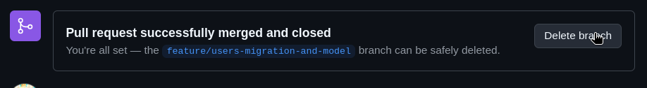

# Daftar Isi

- [Git dan Github](#git-dan-github)
- [Alur Penggunaan Git dan Github](#alur-penggunaan-git-dan-github)
- [Contoh Alur](#contoh-alur)
  - [1. Clone Repository](#1-clone-repository)
  - [2. Buat Branch Baru](#2-buat-branch-baru)
  - [3. Lakukan Perubahan](#3-lakukan-perubahan)
  - [4. Commit Perubahan](#4-commit-perubahan)
  - [5. Push ke Remote Repository](#5-push-ke-remote-repository)
  - [6. Bikin Pull Request](#6-bikin-pull-request)
  - [7. Review Pull Request](#7-review-pull-request)
  - [8. Hapus Branch yang Udah di-merge dan Tarik Perubahan Terbaru ke Local Repo](#8-hapus-branch-yang-udah-di-merge-dan-tarik-perubahan-terbaru-ke-local-repo)
- [Github Issues](#github-issues)

# Git dan Github

Penjelasan general tentang Git dan Github bisa di baca di dokumentasi Github [[About Git and Github](https://docs.github.com/en/get-started/start-your-journey/about-github-and-git)] atau artikel Dicoding yang lebih gampang di pahami [[Perbedaan Git dan Github](https://www.dicoding.com/blog/perbedaan-git-dan-github/)].

Ada beberapa setup yang perlu kalian lakuin kalo sebelumnya belum pernah konfigurasi Git di device kalian. Buka terminal, terus ketik ini:

```bash
# Setel username github kalian untuk git
git config --global user.name "usernamegithub"

# Setel email github kalian untuk git
git config --global user.email "email@example.com"

# Di sini gua anggep semuanya pake vscode ya,
# Setel code editor default untuk git 
git config --global core.editor "code --wait"
```

## Alur Penggunaan Git dan Github

Secara umum, orang pake Git dan Github itu gini:

1. Clone repository
2. Buat branch baru
3. Lakukan perubahan
4. Commit perubahan
5. Push ke remote repository
6. Bikin pull request
7. Setelah direview, pull request di acc dan dimerge ke branch main
8. Hapus branch yang sudah dimerge ke main
9. Repeat untuk fitur baru

## Contoh Alur

Nah di sini gua bakal coba contohin alur tersebut, untuk yang sederhana dulu. Di sini gua pengen bikin migrasi tabel untuk tabel users di database dan juga buat edit sedikit model User berdasarkan migrasi yang udah gua bikin. Dan gua bakal tetapin kriteria penyelesaiannya begini:

1.   User punya kolom: user_id, nama, email (unik), no_telepon (unik), password, dan role (enum: [admin, nasabah])
2.   Setel default value untuk role ke nasabah
3.   Migrasi selesai dibuat dan bisa dijalankan tanpa error
4.   Tabel terbuat di database
5.   Bisa buat row/instance baru dari model User tanpa error
6.   Pastiin constraint unik bekerja

### 1. Clone Repository

Untuk clone repository bisa tinggal buka vscode dan masuk workspace kosong. Habistu buka terminal di vscode dan change directory ke tempat di mana repositorinya mau diclone.

```bash
git clone git@github.com:badiwidya/rpl-bank-sampah.git
```

### 2. Buat Branch Baru

Nah setelah diclone, selanjutnya bikin branch baru untuk ngelakuin perubahan ke repositori, bisa lewat terminal atau vscode langsung. Kalo di terminal command-nya begini:

```bash
git switch -c feature/users-migration-and-model
```

Nah, seharusnya sekarang branch baru udah dibuat dan sekaligus udah pindah branch ke yang baru tersebut, jadi udah bukan di main lagi. Untuk konfirmasi bisa liat pake command `git branch`. Nah branch yang aktif sekarang itu ditandai sama asterisk (\*) di samping nama branch.

<p align="center"></p>

Kalo terminal ribet, ya sekarang mah udah dipermudah, langsung aja di vscode liat di status bar pojok kiri bawah ada nama branch yang lagi aktif sekarang, bikin branch baru tanpa terminal juga bisa dari situ.

<p align="center"></p>

### 3. Lakukan Perubahan

Perubahan yang gua lakukan di sini simpel ya, cuma buat migrasi untuk tabel user berdasarkan ERD yang udah kita buat dan edit sedikit model User untuk nyesuain sama tabelnya.

Karena di sini Laravel udah buat beberapa file migrasi buat tabel users, gua tinggal edit biar nyesuain sama ERD yang udah kita bikin.

```php
Schema::create('users', function (Blueprint $table) {
    $table->id();
    $table->string('name');
    $table->string('email')->unique();
    $table->string('no_telepon')->unique();
    $table->timestamp('email_verified_at')->nullable(); // Karena kita mau user verifikasi email ini tetep ada
    $table->string('password');
    $table->enum('role', ['nasabah', 'admin'])->default('nasabah');
    $table->rememberToken();
    $table->timestamps();
});
```

Sebelum commit gua mau mastiin beberapa kriteria penyelesaian yang udah gua tetapkan tadi berhasil gitu dari perubahan yang udah gua buat. Untuk poin 1 dan 2 udah otomatis done dari perubahan yang baru aja gua lakuin.

Lalu untuk poin ke 3 dan 4 gua coba jalanin migrasi, dan migrasi juga bisa dijalanin tanpa error. Dan tabel users udah terbuat di database 'bank_sampah' di MySQL. Untuk poin selanjutnya bisa dites kalo gua udah selesai buat perubahan ke model User.

Best practicenya sih dites dulu perubahannya baru commit, tapi nanti bisa difix sih hehe.

### 4. Commit Perubahan

Nah karena di sini gua udah buat perubahan, selanjutnya gua bakal masukin perubahan ini ke [*staging area*](https://git-scm.com/about/staging-area) buat di-commit nantinya.

Di sidebar vscode ada logo cabang (branch). Nah di situ tinggal tambahin aja file yang udah diedit dan mau dimasukkin ke staging area untuk dicommit.

<p align="center"></p>

Nah selanjutnya tinggal isi pesan commit yang deskriptif, terus commit deh.

<p align="center"></p>

Tapi minus bikin commit message di vscode langsung, dia ga bisa bikin pesan multiline, jadinya ga bisa kasih deskripsi lengkap untuk perubahan. Kalo gua biasa nambahin file/milah file untuk dimasukkin ke staging area lewat vscode, tapi kalo mau commit lewat command line.

```bash
git commit
```

Nah nanti bakal muncul semacam file baru di vscode, pesan commit tinggal di isi disitu deh.

<p align="center"></p>

Sekarang tinggal pencet lambang centang di pojok kanan atas editor buat save commit message. Nantinya graph di sidebar bakal berubah

<p align="center"></p>

Kalo mau full pake command line bisa pake ini:

```bash
git add . # artinya masukin semua perubahan di parent folder ke staging area
# atau
git add pathkefile # masukin cuma beberapa file yang diubah ke staging area

git commit
```

Nah, untuk perubahan lain (edit model User) gua ngerepeat lagi dari buat perubahan -> commit changes baru lanjut ke tahap berikutnya.

> ⚠️ Saran gua untuk commit: jangan nunggu banyak file yang diedit baru commit terus pesannya "update". Fungsi git kan untuk buat snapshot dan bisa revert ke commit tertentu kalo ada masalah. Jadi ya lebih mempermudah aja ngelacaknya kalo commit kecil yang mewakili satu perubahan.

### 5. Push Ke Remote Repository
Kan di gambar graph sebelumnya ada keterangan origin/main di bawah commit yang baru aja dibuat ya. Nah origin ini remote/referensi untuk repositori kita yang udah terpublish ke layanan hosting git (kita pake Github). 

> 💡 **Note:** Repositori di Github sebutannya **remote repository**. Kalo folder yang ada di device kita itu sebutannya **local repository**. Perubahan yang kita buat di local repository ngga akan langsung ada di remote repository sebelum kita push (dorong) perubahan ke remote.

Push ke remote repository juga bisa berarti upload branch baru kita ini ke repository Github kita. Caranya? Tinggal pencet aja tombol Publish Branch yang ada di Source Control vscode. 

<p align="center"></p>

atau kalo mau lewat command line bisa pake:

```bash
git push -u origin feature/users-migration-and-model
# parameter setelah origin itu nama branch lokal yang mau dipush
# Note: parameter setelah push "-u origin namabranch"
# perlu dijalanin sekali aja, kalo mau push lagi di branch yang sama
# bisa langsung "git push" aja. Tapi kalo misal ganti branch dan
# belum pernah push di branch itu tulis lengkap kayak gitu.
```

### 6. Bikin Pull Request
Nah sekarang kita buka repository kita di Github, pasti langsung ada notifikasi kayak gini:

<p align="center"></p>

Tinggal dipencet aja itu tombol "Compare & pull request" nya. Nanti bakal diarahin ke halaman untuk buat pull request. Di situ tinggal isi aja deskripsi perubahan yang dibuat di branch tersebut, baru buat pull request.

> 💡 **Note:** pastiin di bagian atas dia ijo dan tulisannya **able to merge** yang berarti branch yang udah kalian buat perubahan ga ada konflik sama branch main dan bisa dimerge.

<p align="center"></p>

### 7. Review Pull Request
Setelah itu bisa liat liat dulu perubahan yang kalian buat, direview. Kalo mau juga kita saling review aja dari kedua tim (frontend/backend) sebelum pull request bener-bener dimerge. Kalau emang gaada masalah, bisa langsung merge aja, di sini gua saranin pakenya **Squash & merge** biar clean juga history commit di main.

<p align="center"></p>

### 8. Hapus Branch yang Udah di-merge dan Tarik Perubahan Terbaru ke Local Repo
Habis dimerge? hapus aja branch-nya, udah ngga kepake.

<p align="center"></p>

Nah step selanjutnya mungkin terkait, gimana cara ngambil perubahan terbaru di remote ke local repository kita (pull).

Stepnya kurang lebih gini:
1. Pindah ke branch main lagi
2. Pull main dari remote repository
3. Hapus branch yang udah kita buat sebelumnya

Di sini nama branch gua sebelumnya itu feature/users-migration-and-model, jadi command yang bakal gua jalanin kaya gini:
```bash
# Ganti ke branch main
git switch main

# Pull perubahan terbaru dari remote repository
git pull origin main

# Hapus branch yang udah ga kepake
git branch --delete feature/users-migration-and-model
```

Gitu kurang lebih, nah kalo misal nih kalian lagi kerjain di branch kalian, dan di main ada commit baru. Nah kan biar menghindari konflik juga nantinya local repo kita (termasuk branch yang lagi kita kerjain) harus up to date dan sinkron sama main kan. Gini caranya:

1. Pastiin semua perubahan kalian udah dicommit.
2. Kalo udah, pindah ke branch main pake `git switch main`
3. Pull perubahan dari remote repository `git pull origin main`
4. Balik lagi ke branch yang kalian kerjain `git switch namabranch`
5. Pastii kalian udah di branch kalian, terus merge main ke branch kalian `git merge main`
6. Kalo ada konflik bisa diselesain dulu, terus add penyelesaian konflik ke staging baru `git commit`

### Github Issues
Sebenernya ini opsional si, bisa bertindak sebagai todolist dan biar bisa dokumentasiin pengerjaan fitur lebih jelas, bebas mau make apa ngga.